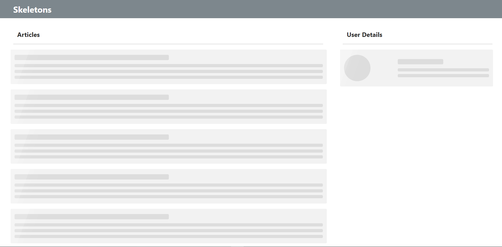

# <p align="center">🦴 Skeleton 🦴</p>
<p align="center">Skeleton: my first layout using skeleton at loading time (test project)</p>
<h1 align="center">
 
  

</br>
</h1>
</br>

## 🛠 Technologies used

     


## 🚀 How to start

> 🐑 clone the repository
```bash
git clone https://github.com/LuciLua/Skeletons.git
```

> 📂 open project folder
```bash
cd ./Skeletons
```

> ⚡ install all packages using npm or yarn manager (using YARN)

```bash
yarn
```

> 🌟 start the development server (using YARN)

```bash
yarn dev
```

> 🏗 to make a build (using YARN)

```bash
yarn build
```

> ✨ to start the server in production-ready mode (using YARN)

```bash
yarn start
```

## 👥 Making code concise if you make changes

> 🔎 check if there is anything to change

```bash
yarn lint
```

> ✏ still using prettier, have it format the code automatically

```bash
yarn write
```

## 🖼 Preview

So far, this is the preview

